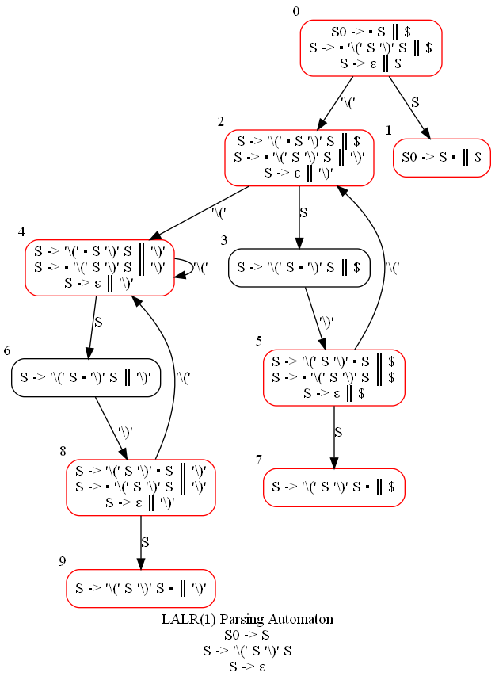
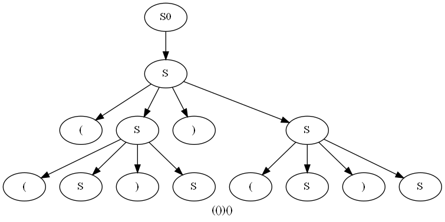

# LARL(1) Parser Generator

Java implementation of [LALR(1) parser](https://en.wikipedia.org/wiki/LALR_parser) generator with supported synthesized attributes written as a home assignment for parsing course in ITMO University.  

## Features

* Generate parsers for LALR(1) grammars
* Parsing automaton visualization
* Regular expressions in tokens
* Synthesized attributes
* TODO: Ambiguous grammar check

## Examples

Consider a simple grammar for [balanced bracket sequences](https://cp-algorithms.com/combinatorics/bracket_sequences.html):

```text
S0 -> S;

S  -> '(' S ')' S;
S  -> ε;
```

The following parsing automaton can be obtained from this grammar:



The following [AST](https://en.wikipedia.org/wiki/Abstract_syntax_tree) can be built from the input `(())()`:



An example of the more complex grammar for arithmetic expressions with usage of synthesized attributes to calculate expression value:

```text
E0 [long val] -> E {val = $0.val;};

E [long val]  -> E '+' T {val = $0.val + $2.val;} | E '-' T {val = $0.val - $2.val;} | T {val = $0.val;};
T [long val]  -> T '*' F {val = $0.val * $2.val;} | T '/' F {val = $0.val / $2.val;} | F {val = $0.val;};
F [long val]  -> P '**' F {val = (long) Math.pow($0.val, $2.val);} | P {val = $0.val;};
P [long val]  -> r'[+-]?([1-9][0-9]*|0)' {val = Long.parseLong($0);} | '(' E ')' {val = $1.val;};

@skip r'[ \n\r\t]+';
```

## Usage

To generate LALR(1) parser based on a context free grammar first you need to specify grammar productions in form described in [grammar for grammars](src/main/java/ru/unrealeugene/parsing/generating/grammar). After that the [GenerateParser](src/main/java/ru/unrealeugene/parsing/generating/grammar/GrammarLexer.java) class needs to be called with path to grammar as its first argument and, possibly, more optional arguments:

```text
-o <path>: output path for generated sources (required)
-i <path>: output path for parsing automaton images (by default images are not generated)
-n <name>: grammar name used as generated class prefix (default: grammar file name)
-p <name>: generated classes package (default: empty)
```

After a successful execution three Java classes will be generated in specified output path: Lexer, Parser and Token. 

**Note:** If you want to generate parsing automaton images, you'll need to install [GraphViz](https://graphviz.org/) and then provide a path to GraphViz executable in [config.properties](src/main/resources/config.properties) file. 